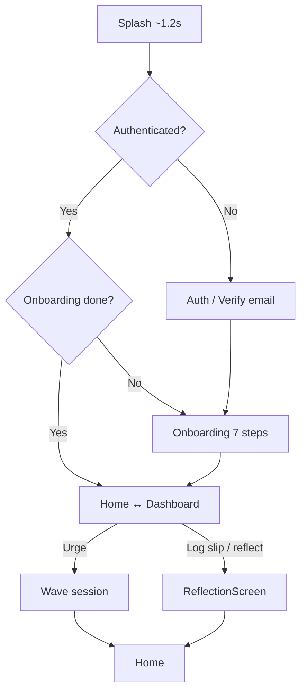
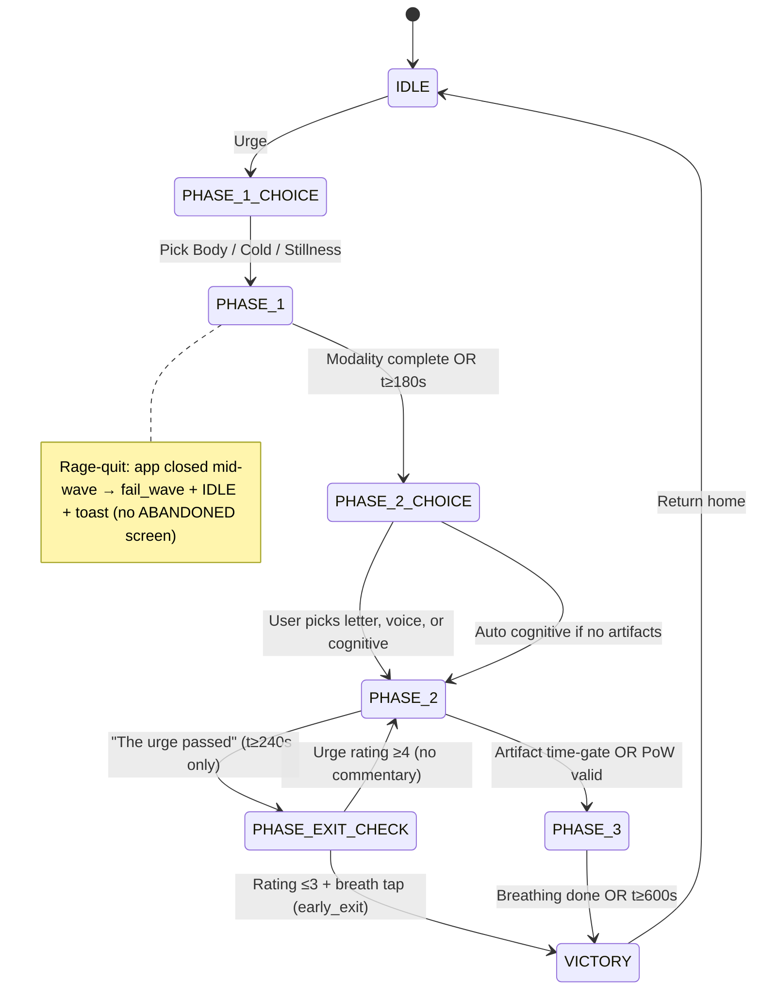

# QUM — Features & Flows

**QUM** (repo name: Arch) is an anti-addiction **urge-surfing** app: a timed ~10-minute “wave” session with physical/cognitive tasks, AI proof-of-work, breathing, resilience/XP, commitments, and analytics.

**Stack:** React + Vite + Zustand · Supabase · Capacitor (Android)

---

## Table of contents

1. [Feature inventory](#feature-inventory)
2. [App-level navigation](#app-level-navigation)
3. [Flow: Cold start & boot](#flow-cold-start--boot)
4. [Flow: Authentication](#flow-authentication)
5. [Flow: Onboarding](#flow-onboarding)
6. [Flow: Home (idle hub)](#flow-home-idle-hub)
7. [Flow: Calm-hour ritual](#flow-calm-hour-ritual)
8. [Flow: Commitments](#flow-commitments)
9. [Flow: Wave session](#flow-wave-session)
10. [Flow: Session lock (stepping away)](#flow-session-lock-stepping-away)
11. [Flow: Reflection](#flow-reflection)
12. [Flow: Crisis pathway](#flow-crisis-pathway)
13. [Flow: Urge analytics (dashboard)](#flow-urge-analytics-dashboard)
14. [Flow: Offline & sync](#flow-offline--sync)
15. [Background systems](#background-systems)
16. [Data model (Supabase)](#data-model-supabase)
17. [Rewards & penalties](#rewards--penalties)
18. [Wave timing reference](#wave-timing-reference)
19. [Key modules](#key-modules)

---

## Feature inventory

| Area | What it does |
|------|----------------|
| **Auth** | Email/password sign-in and sign-up via Supabase; email verification gate before app access |
| **Onboarding** | 5-step calibration: peak hour, baseline, north star, wave mechanics, optional **letter to future you**, permissions |
| **Letter to future you** | Private `user_letters` row; optional onboarding + home edit; random Phase 2 / victory surfacing; **8 hardcoded starter prompts** insert as an opening line when the textarea is empty (local `appStorage` only — dismiss, pick-count graduation, no server state) |
| **Voice memo** | Private `voice-memos` storage; onboarding + settings; random Phase 2 / victory surfacing |
| **Home hub** | Resilience shield (0–100), XP, waves surfed, primary **Urge** CTA, commitments panel, analytics entry, manual slip log |
| **Wave session** | Core 10-min state machine: Phase 1 modality choice (Body / Cold / Stillness) → Phase 2 cognitive (AI PoW) → Phase 3 box breathing → victory |
| **Resilience & XP** | +5 resilience & +50 XP on complete; failures (rage-quit) log the wave but do not reduce resilience |
| **Task system** | DB + offline cache of `physical` / `cognitive` / `mindful` tasks; difficulty tier scales with resilience; cognitive tasks are strictly visuospatial/grounding-aligned to crash craving imagery under Elaborated Intrusion Theory |
| **Proof of work** | Camera or text answers validated by Supabase edge function (`validate-pow`, Gemma via OpenRouter) |
| **Commitments** | Time-boxed pledges (2–12h); intercepts Urge taps; hold the line vs typed override reason |
| **Reflection** | Voluntary slip/wave reflection; delayed notification ~5h after failure; voice notes optional |
| **Crisis pathway** | Non-shaming support card on distress signals; verified hotlines; always-available Find support screen |
| **Urge analytics** | 24h heatmap, peak hour, completion rate from wave history |
| **Pattern breakdown** | Top triggers, riskiest location, combined patterns from reflections |
| **Predictive warnings** | Local notifications ~15 min before peak risk hour (onboarding + analytics-derived) |
| **Calm-hour ritual** | Weekly proactive check-in: letter, voice memo, 7-day patterns, optional notes; streak on dashboard |
| **Solidarity signal** | Anonymous live counter on home: active surfers + surfs today; 24h sparkline on tap; no PII |
| **Rage-quit detection** | Session lock persisted locally; force-close mid-wave → wave logged as failed, neutral copy on resume |
| **Offline support** | Task cache, wave start/complete/fail queue, reflections outbox; flush on reconnect |
| **Account** | Header account menu → **Settings** (haptic feedback toggle, letter, voice memo, reflections, calm-hour, find support, sign out) |
| **Native Android** | Camera, local notifications, Preferences storage, app resume detection |
| **Haptic feedback** | Capacitor Haptics on Android at wave gates (breathing phase transitions, victory, read/hear gates, etc.); global toggle in Settings → Feedback |
| **Dev mode** | `VITE_DEV_FAST_WAVE=true` compresses session to 30s |

---

## App-level navigation

While authenticated and onboarded, **only one primary surface** shows at a time: Home, Dashboard, or Wave (plus overlays: session timer, wave-ended acknowledgment).

**Source:** `src/App.tsx`

---

## Flow: Cold start & boot

1. **Splash** (~1.2s): init Capacitor Preferences storage; native chrome on Android (`src/main.tsx`, `src/components/brand/SplashScreen.tsx`).
2. **Session lock check** (`useSessionLockGuard`): if user left mid-wave and returned before end → session lock: wave logged as incomplete, neutral toast; if session expired cleanly → reset idle.
3. **Auth gate**: no user → `AuthScreen`, `SignUpScreen`, `CheckEmailScreen`, or `AuthCallbackScreen` (email link).
4. **Profile load**: commitments hydrate + load; profile must load before main UI.
5. **Onboarding gate**: `has_completed_onboarding === false` → full-screen onboarding only.

---

## Flow: Authentication

| Step | Screen | Actions |
|------|--------|---------|
| Sign in | `AuthScreen` | Email + password → Supabase sign-in |
| Sign up | `SignUpScreen` | Create account → `CheckEmailScreen` immediately |
| Check email | `CheckEmailScreen` | Mail-app instructions; “I've checked my email” → sign-in if confirmed |
| Email link | `AuthCallbackScreen` | `/auth/callback` from confirmation email → sign-in with banner |
| Sign out | `AccountMenu` on home | `secureSignOut()` |

**Source:** `src/components/auth/`, `src/hooks/useAuth.ts`, `src/services/authService.ts`

---

## Flow: Onboarding

Seven steps (`src/components/onboarding/OnboardingFlow.tsx`):

| Step | Content |
|------|---------|
| 1 | Brand intro — “Break the reflex” |
| 2 | **Addiction type** — single-select grid (`doomscroll`, `porn`, `gambling`, `food`, `alcohol`, `nicotine`, `cannabis`, `gaming`, `shopping`, `other`); “Other” reveals a text field |
| 3 | **Peak danger hour** (0–23 slider), **physical baseline** (pushup scale 1–50), **north star** (optional: Mental Clarity / Time Sovereignty / Physical Freedom) |
| 4 | **Voice memo** (~30s): record / stop / replay; **Save** uploads to private `voice-memos` bucket (`{user_id}/onboarding.m4a`) or **Skip**; mic denied → soft fallback copy |
| 5 | **Letter to future you** (optional): textarea with **starter prompts** below when empty (tap to insert opening line + space, cursor at end); 200–500 chars suggested; **Save and continue** or **Skip for now** |
| 6 | Explains 10-minute lock + resilience shield mechanics |
| 7 | Permission rationale; **Grant & Enter** or **Skip** — both call `completeOnboarding` and request notification + camera permissions |

On finish → profile saved (including `addiction_type`, `voice_memo_path`) → user lands on **Home**.

**Types & options:** `src/types/onboarding.ts` · **Voice memo service:** `src/services/voiceMemoService.ts` · **Post-onboarding:** Account menu → **Voice memo** (`VoiceMemoSettings.tsx`)

**Telemetry:** `onboarding_addiction_selected`, `voice_memo_recorded`, `voice_memo_skipped`, `letter_skipped_in_onboarding`, `letter_starter_*` (index only — never body text)

**Letter starters (onboarding step 5 + home editor):** Eight static opening lines in `src/lib/letter/starterPrompts.ts` — not AI, not personalized. Shown only while the textarea is empty; hidden after the user types or taps **Hide these** (persisted locally). After **3 picks** across sessions, the list collapses by default; **Show starters** reopens it. Preferences live in `appStorage`, not Supabase.

---

## Flow: Home (idle hub)

**Displays:** resilience bar, XP, waves surfed, **solidarity card** (anonymous “surfing now / today” counts), large **Urge** button, “Log a slip that already happened”, **Urge analytics** button, **Commitments** panel.

**Source:** `src/components/home/HomeScreen.tsx`

### Actions from home

| Action | Result |
|--------|--------|
| Tap **Urge** | → Commitment check (if active) OR start wave |
| **Urge analytics** | → `DashboardScreen` (blocked until onboarding done) |
| **+ Set a commitment** | → `SetCommitmentScreen` |
| **Log a slip…** | → `ReflectionScreen` (`manual_log` mode) |
| **Recent waves** | Last 7 days without a reflection → tap to reflect on that wave |
| **Edit your letter** | Shown when a letter exists → `LetterEditorScreen` |
| **Calm-hour card** | When due (7+ days since last check-in): one-line reminder above Urge → `CalmHourScreen` |
| **Solidarity card** | Tap to expand 24h sparkline; **?** explains “We only count waves, never people.” |
| **Support card** | Shown below resilience when client-side distress signals fire (never auto-routes) |
| **Settings** | Account menu → **Why urges pass** (science brief), letter, voice memo, reflections, calm-hour, find support, sign out |
| **Why urges pass** | Home link or Settings → full-screen scroll brief (`public/brief/`, ~14 min, interactive diagrams) |

### Solidarity signal (anonymous)

- **Data:** `active_waves_ticker` hourly buckets (`wave_starts`, `waves_in_progress`) — no `user_id`, no PII.
- **Tick:** DB trigger on `waves_log` insert; **untick:** inside `complete_wave` / `fail_wave` RPCs (and edge functions `tick-wave` / `untick-wave` for service use).
- **Read:** `public_solidarity_view` → `active_now`, `surfs_today`; hourly rows for sparkline.
- **Client:** `useSolidaritySignal` polls every 30s on Home; caches last values in appStorage for offline.
- Telemetry: `solidarity_card_tapped` (expand only).

During an active wave, home/dashboard are hidden; user is forced into `WaveSession`. There is no in-session abandon control — stepping away closes the app and is handled by the session lock on resume.

---

## Flow: Settings

Account menu → **Settings** (`SettingsScreen.tsx`):

| Item | Destination |
|------|-------------|
| Haptic feedback | Toggle in **Feedback** section — `qum_haptics_enabled` (default on). Disables all wave haptics when off. Android native only for now. |
| Why urges pass | `BriefScreen` — embedded plain-English science brief (companion to the app; not required reading) |
| Edit letter | `LetterEditorScreen` (same starter prompts as onboarding when textarea is empty) |
| Manage voice memo | `VoiceMemoSettings` |
| Reflection history | `ReflectionsHistoryScreen` |
| Calm-hour reminder | `CalmHourSettingsScreen` (weekday + time; optional auto hour from activity) |
| Find support | `FindSupportScreen` |
| Sign out | `secureSignOut()` |

**Source:** `src/components/settings/`

---

## Flow: Calm-hour ritual

Proactive weekly reflection outside urge moments — letter, voice memo, patterns, and notes.

### Scheduling

`useCalmHourScheduler` derives the user's **calmest awake hour** from `waves_log` + `reflections` (lowest activity 7:00–23:00; fallback inverse of `peak_danger_hour` or 10:00). On the default weekday (**Sunday**), a local notification fires: *"Take 5 minutes for a calm-hour check-in."* Deduped per ISO week via `CALM_HOUR_SCHEDULE` in appStorage.

**Source:** `src/hooks/useCalmHourScheduler.ts`, `src/lib/calm/computeCalmHour.ts`, `src/services/notificationService.ts` (`scheduleCalmHourCheckIn`)

### Entry points

| Entry | Behavior |
|-------|----------|
| Notification tap | Opens home → `CalmHourScreen` (native: `CALM_HOUR_NOTIFICATION_ID`) |
| Dashboard | **Start calm-hour check-in** + **Calm-hour streak: N weeks** at top |
| Home | Dismissible card when due: *"Your calm-hour check-in is ready."* |

### Check-in flow (`CalmHourScreen.tsx`)

| Step | Content | Skip |
|------|---------|------|
| 1 | Read letter (+ **Edit letter**) | Yes |
| 2 | Listen to voice memo (+ **Re-record**) | Yes |
| 3 | **Last week's patterns** — `PatternBreakdown` (7d) | Yes |
| 4 | Optional notes textarea | Yes |
| Done | Saves `calm_hour_sessions` row; confirmation → Home | — |

Telemetry: `calm_hour_started`, `calm_hour_completed`, `calm_hour_step_skipped` (`step` 1–4).

**Due rule:** 7+ days since last `completed_at` (or never completed). Card dismiss hides for current ISO week only.

---

## Flow: Commitments

### Create commitment

1. Choose duration: **2 / 4 / 8 / 12 hours**
2. Write pledge (min 10 chars, max 240)
3. **Activate** → stored locally + synced to Supabase

**Source:** `src/components/home/SetCommitmentScreen.tsx`, `src/stores/commitmentStore.ts`

Commitments are independent of waves. A user with an active commitment who taps **Urge** goes straight into the wave — surfing is how they keep the commitment, not a way around it. Commitments end either when the window expires (`honored=true`) or when the user manually marks them broken on Home (`honored=false`, their call, always).

### Break commitment (user-driven)

On Home, **I broke this commitment** near the active card → `honored=false` → `CommitmentBreakScreen` (“Set a new commitment” / “Not right now”). No penalty, no streak loss. Broken commitments remain in history for future pattern views.

### Expiry (honored)

When `ends_at` passes without a manual break, `finalizeExpired` sets `honored=true`. Next Home open shows a one-time dismissible toast (e.g. “You held the line for 4 hours. That counts.”).

**Source:** `src/components/home/CommitmentsPanel.tsx`, `src/components/home/CommitmentBreakScreen.tsx`, `src/stores/commitmentStore.ts`

---

## Flow: Wave session

**Default timing:** 600s max total · Phase 1 window 180s · Phase 2 until 480s · Phase 3 = 64s box breathing (4×4×4×4 × 4 cycles). **Minimum** when the urge breaks early: 240s in Phase 2 + ~15s exit check ≈ **4m 15s** (not before 4 minutes). See [Wave timing reference](#wave-timing-reference).

**Global UI:** fixed header `SessionTimer` with countdown + progress bar; `beforeunload` warning while locked.

**Source:** `src/stores/waveStore.ts`, `src/components/wave/WaveSession.tsx`

### Wave modes

| Mode | UI | Entry / exit |
|------|-----|----------------|
| `IDLE` | Home | Default |
| `PHASE_1_CHOICE` | Body / Cold / Stillness picker | Urge (always direct) |
| `PHASE_1` | Active modality flow | After modality selected |
| `PHASE_2_CHOICE` | Letter / voice / cognitive picker | Phase 1 complete (skipped if only cognitive) |
| `PHASE_2` | Letter, voice memo, or cognitive task | After Phase 2 choice; muted **“The urge passed.”** link after t≥240s |
| `PHASE_EXIT_CHECK` | Forced pause → 0–10 urge rating → optional breath → early victory | From Phase 2 only, t≥240s; rating ≤3 completes; rating ≥4 returns to Phase 2 silently |
| `PHASE_3` | Box breathing (unskippable) | PoW accepted or timer forces phase 3 |
| `VICTORY` | Rewards screen | Breathing complete, early exit check, OR global timer = 0 |
| `ABANDONED` | *(unused in UI)* | Legacy type; no user-facing path |

### State machine

### Phase 1 — Modality choice

After Urge, user picks one of three cards (no back, no abandon):

| Modality | Flow | Advance to Phase 2 |
|----------|------|-------------------|
| **Body** | **Physical** task from offline cache, resilience-scaled difficulty; tap-count verifier | Tap target met **or** global phase timer ≥ 180s |
| **Cold** | **Cold** task from the task pool (face, wrist, neck, full). Safety notes where relevant. Cold tasks use commonly available resources — running water, cloth, splashing. Tasks that assume a freezer or ice were removed. Countdown after “I'm doing it.” | Task `duration_sec` elapsed **or** global phase timer ≥ 180s |
| **Stillness** | **Mindful** task from the task pool (grounding, body scan, breath, noting, observation). Tasks include concrete grounding, body anchors, observation exercises, and breath anchors with explicit permission to lose focus and return. Multi-step tasks show a **Next** button that becomes tappable after 60% of each step's time (minimum 8s). Users who finish a step early can advance; users who haven't engaged still wait most of the duration. Single-prompt tasks stay pure time-gated. | All steps / single timer done **or** global phase timer ≥ 180s |

Telemetry: `phase1_modality_selected` with `{ modality }`; `phase1_task_selected` with `{ category, modality, difficulty_tier, task_id_hash }`.

Task categories: `physical`, `mindful`, `cold`, `cognitive` (Phase 2 only for cognitive).

**Source:** `src/components/wave/Phase1Choice.tsx`, `Phase1Body.tsx`, `Phase1Cold.tsx`, `Phase1Stillness.tsx`, `src/types/wave.ts`, `src/repositories/taskRepository.ts` (`pickBodyTask`)

### Phase 2 — User chooses the response

After Phase 1, the user picks **one** of three cards (`Phase2Choice.tsx`) — same pattern as Body / Cold / Stillness. No randomization.

| Option | Enabled when | Work |
|--------|----------------|------|
| **Read what you wrote yourself** | Non-empty letter on file | 8s read gate, then continue |
| **Hear yourself** | Voice memo saved **and** opted in for in-wave playback at recording time | Full playback required before continue |
| **Think it through** | Always | Cognitive task + AI PoW (camera or text) |

If only cognitive is available (no letter, no in-wave voice memo), the choice screen is **skipped** and cognitive loads immediately.

Repeat protection: the option used in the **last completed wave this session** shows a “Just used” badge (not disabled).

Telemetry: `phase2_choice_made` with `{ option, had_alternatives_count }`.

**Letter path** (`Phase2Letter.tsx`):

- Full-screen letter with generous typography; header “From you, {relative_time} ago.”
- **I read it** enabled after 8 seconds of reading time — no AI validation.
- Telemetry: `letter_surfaced_in_wave` (character count only).

**Voice memo path** (`Phase2VoiceMemo.tsx`):

- Header: “Listen to yourself.”
- Plays the user’s memo from cached storage (signed URL + blob, 1h TTL in IndexedDB).
- **I heard it** enabled only after playback completes — no skip, no transcript.
- Telemetry: `voice_memo_surfaced_in_wave`.

**Cognitive path** (`Phase2Cognitive.tsx`):

- Resilience-scaled **cognitive** task: `camera_upload` or `text_input`.
- **Psychological Task Alignment (Elaborated Intrusion Theory):** In alignment with Kavanagh, Andrade, & May (2005), the cognitive task bank is strictly designed to compete for the **visuospatial sketchpad** (the mind's visual RAM) to "crash" craving imagery. Problematic tasks that require heavy prefrontal semantic, analytical, or emotional labor (e.g., listing self-help tips like "10 ways to fall asleep faster", planning future chores, or intense emotional introspection like "reasons to tell a younger you to keep going") are avoided, as they spike stress/anxiety and trigger wave rage-quits. Instead, the task bank relies on non-judgmental **visuospatial grounding puzzles** (e.g., 3D mental paths, environment shape scanning, relative scale sizing, object colors/textures, mental analog clock rotation, and kitchen cabinet audits).
- Pool includes **Ethiopian-context** prompts (dishes, places, Amharic/local language, markets in “your city,” coffee ceremony / mesob sketches) alongside existing global trivia — rotation stays local without excluding diaspora or Western-knowledge users.
- **AI validation** via edge function; retry on failure.
- “Ahead of schedule” hint if finished early in phase window.

All paths → Phase 3 on completion (unless early exit below).

**Early victory (not abandon):** After **240s** of total wave time, a muted link **“The urge passed.”** appears at the bottom of any Phase 2 screen. Tapping it enters `PHASE_EXIT_CHECK` (`PhaseExitCheck.tsx`):

1. **5s pause** — “Is the urge actually gone, or just quieter?” Continue disabled until countdown ends.
2. **0–10 slider** — logged as `urge_rating_at_exit` when completing early. Rating **≥4** → silent return to the same Phase 2 task (no “you weren’t ready” copy). Rating **≤3** → wrap-up prompt, then one guided breath (5s in / 5s out), tap to finish.
3. Wave completes as **`completion_mode: early_exit`**, `completed: true`, same XP and resilience as a full wave.

Not available in Phase 1, before 4 minutes, or in Phase 3. Telemetry: `exit_check_started`, `exit_check_rating`, `exit_check_returned_to_phase2`, `exit_check_completed_early`.

**Source:** `Phase2Cognitive.tsx`, `Phase2Letter.tsx`, `Phase2VoiceMemo.tsx`, `PhaseExitCheck.tsx`, `UrgePassedLink.tsx`, `src/services/voiceMemoService.ts`, `src/lib/storage/voiceMemoCache.ts`

### Phase 3 — Breathing

- **Box breathing** UI (inhale / hold / exhale / hold), 4 cycles.
- Cannot skip; ticks each second while in Phase 3.
- Completing breathing (or total 600s) → **Victory**.

**Source:** `src/components/wave/Phase3Breathing.tsx`, `src/lib/breathing/boxBreathing.ts`

### Victory

- If the user had an **active commitment at wave start**, show cooperative copy and the quoted pledge above the reward chips (only wave ↔ commitment touchpoint).
- **Headline** rotates among **letter** (~200 chars + “Read full letter”) or **voice memo** (play + duration) — not the commitment pledge (shown separately when applicable).
- +50 XP and +5 resilience shown as small chips at the top (not the headline).
- `complete_wave` RPC (or offline queue).
- Telemetry: `victory_artifact_shown` with `{ artifact_type: pledge | letter | voice_memo }`.
- **Return home** → `IDLE`.

**Source:** `src/components/wave/VictoryScreen.tsx`, `src/lib/victory/pickVictoryArtifact.ts`

### In-session exit

- No abandon button in any phase. To leave, the user closes the app; **session lock** handles failure on resume (see rage-quit flow).

---

## Flow: Session lock (stepping away)

1. On wave start, **session lock** written (user, wave IDs, end time).
2. If app killed / backgrounded while `isLocked` and user returns **before** `targetEndTime`:
   - Wave failed in `waves_log` via `fail_wave` (sync queue reason `rage_quit` when offline)
   - **Resilience unchanged**
   - Neutral toast: “Wave ended. Resilience held steady.”
   - **RageQuitOverlay** once on next boot (supportive copy, single **Got it** — no forced audit)
3. Also re-evaluated on window focus, visibility, and Capacitor `appStateChange` resume.

If lock expired past end time → clean reset, no failure logging.

**Source:** `src/lib/storage/sessionLock.ts`, `src/services/rageQuitService.ts`, `src/hooks/useSessionLockGuard.ts`, `src/components/wave/RageQuitOverlay.tsx`, `src/components/ui/WaveEndToast.tsx`

---

## Flow: Reflection

Voluntary, non-interrogative reflection — never forced after a failed wave.

### Delayed prompt (after wave failure)

On **session end** (step away / `fail_wave`), `reflectionScheduler` schedules a local notification for **~5 hours later** (max **one per calendar day**):

> *When you're ready, take a couple minutes to look at what happened. No pressure.*

Tapping opens `ReflectionScreen` with `mode: delayed_prompt` and the `wave_id` pre-linked.

Telemetry: `reflection_prompt_fired`, `reflection_opened`, `reflection_submitted` (includes `skipped_field_count`).

### Entry points

| Entry | Mode |
|-------|------|
| Delayed notification | `delayed_prompt` |
| Home → “Log a slip that already happened” | `manual_log` |
| Home → **Recent waves** (last 7 days, no reflection yet) | `post_wave` |

### Screen flow (`ReflectionScreen.tsx`)

- **Leave anytime** — no hardware back block, no forced routing from wave store.
- Each step has **Continue** and **Skip** (no auto-advance).
- Labels: **What were you up against?** · **Where were you?** · **What got in?**
- Manual log adds an optional **when** step first.
- Free-text fields support optional **voice notes** (stored in `reflection-audio` bucket; no transcription).
- All fields optional — submit with any subset.
- Confirmation: *“Saved. Be gentle with yourself today.”* → user taps **Done**.

### Data

Table **`reflections`** (renamed from `crash_reports`; view `crash_reports` for compat). Columns include `mode`, optional `trigger`/`location`/`loophole`, and `*_audio_path` fields.

**Source:** `src/components/reflect/ReflectionScreen.tsx`, `src/services/reflectionService.ts`, `src/services/reflectionScheduler.ts`

---

## Flow: Crisis pathway

When local data suggests real distress, QUM surfaces a **single optional card** — never a forced flow or interrogation.

### Distress signals (client-only)

`detectCrisisSignal` in `src/lib/crisis/signalDetector.ts` runs on device over recent `waves_log` + `reflections`. **Nothing is sent to the server.**

| Signal | Threshold |
|--------|-----------|
| Failed waves | 5+ failures in 48 hours |
| Consecutive bad days | 3+ calendar days in a row with wave activity, zero completions, all failures |
| Reflection language | Conservative substring match on free-text fields (`distressLanguage.ts`) — hopelessness / self-harm phrasing |

- **One** active signal → **soft** card copy.
- **Two or more** → **firm** copy.
- **Not now** dismisses the card for **48 hours** (`CRISIS_CARD_DISMISS` in appStorage).

### Support card (`SupportCard.tsx`)

Placed on home **below the resilience bar** when `showCrisisCard` is true. User must tap an action — no auto-navigation.

| Button | Action |
|--------|--------|
| Talk to someone now | → **Find support** screen (hotline list) |
| Find a therapist | Opens Psychology Today (locale-aware URL) |
| Not now | Dismiss 48h |

### Find support (always available)

Account menu → **Find support** → `FindSupportScreen.tsx` with the same hotline list, independent of whether the card fired.

Hotlines live in `src/lib/crisis/hotlines.json` (verified numbers; addiction-type mapping). Examples: SAMHSA (alcohol/substance), NCPG (gambling), 1-800-QUIT-NOW (nicotine), National Alliance for Eating Disorders (food — not legacy NEDA), **988** (US crisis), Samaritans + Find A Helpline (international).

Telemetry: `crisis_card_shown` (`severity`), `crisis_action_tapped` (`action`, `surface`) — **never** reflection body or distress phrases.

**Source:** `src/lib/crisis/`, `src/hooks/useCrisisSignal.ts`, `src/components/crisis/SupportCard.tsx`

---

## Flow: Urge analytics (dashboard)

1. From home → **Urge analytics**
2. **UrgeHeatmap**: 24-hour activation counts, peak hour, completion rate
3. **PatternBreakdown**: top 3 triggers, highest-risk location %, strongest trigger+location combo (from reflections)
4. **Refresh** reloads waves + patterns
5. **`usePredictiveUrgeWarnings`**: if ≥3 waves logged, computes peak-risk hour and schedules daily notification at **(peakHour − 1):45** with a grounding insight

**Back** → home.

**Source:** `src/components/dashboard/DashboardScreen.tsx`, `src/hooks/useUrgeAnalytics.ts`, `src/hooks/usePatternBreakdown.ts`, `src/services/notificationService.ts`

---

## Flow: Offline & sync

On login and when connectivity returns:

- Refresh **task cache** from Supabase (fallback tasks if offline)
- **Flush sync queue**: pending wave start/complete/fail, commitment updates, letter upserts
- **Flush reflections outbox**

Waves can start/complete/fail locally with `localWaveId` and sync when online.

**Source:** `src/hooks/useOfflineSync.ts`, `src/services/syncQueueService.ts`, `src/repositories/taskRepository.ts`, `src/services/waveOperations.ts`

---

## Background systems

| System | Behavior |
|--------|----------|
| **Telemetry** | Events e.g. `reflection_*`, `crisis_*`, `letter_created`, `letter_surfaced_in_wave` (never letter body or distress text) |
| **Task repository** | `pickTask(category, resilience)` from cached pool |
| **Profile store** | Optimistic resilience/XP/wave count on complete only |
| **Notification schedule** | Deduped per day per peak hour in local storage |
| **Session lock guard** | Runs whenever authenticated user is booting |

---

## Data model (Supabase)

| Table / RPC | Purpose |
|-------------|---------|
| **profiles** | Resilience, XP, waves surfed, onboarding fields (`addiction_type`, `addiction_type_other`, `peak_danger_hour`, `physical_baseline`, `north_star`, `voice_memo_path`) |
| **calm_hour_sessions** | Weekly check-in completion + which steps were reviewed + optional `notes` |
| **active_waves_ticker** | Anonymous hourly wave counters; feeds `public_solidarity_view` |
| **waves_log** | Each urge session (`started_at`, `completed`, `duration_survived`) |
| **tasks** | Seeded physical / cognitive / mindful prompts; cognitive prompts are aligned with Elaborated Intrusion Theory (strictly visuospatial grounding) |
| **commitments** | Pledge, window, `honored` (true = expired clean, false = user-marked broken) |
| **user_letters** | One private letter per user (`body`, `created_at`, `updated_at`) |
| **reflections** | Voluntary reflections (`mode`, optional fields, voice paths); linked to `wave_id` via `audit_id` on `waves_log` |
| **complete_wave** / **fail_wave** | RPCs updating wave + profile stats |

Migrations: `supabase/migrations/`

---

## Rewards & resilience

| Event | Resilience | XP | Waves |
|-------|------------|-----|-------|
| Complete wave | Recomputed (see below) | +50 | +1 |
| Step away mid-wave | Recomputed (mild negative in window) | — | fail logged |

**Resilience (30-day rolling window)** — computed from recent events, not time since last open:

| Signal | Per event | Cap |
|--------|-----------|-----|
| Wave completed | +2 | +30 |
| Wave failed (rage-quit / early end) | −1 | −10 |
| Reflection submitted | +1 | +10 |
| Calm-hour completed | +5 | +15 |
| Commitment manually broken | −2 | −10 |

Base score: **50**, then add capped contributions, clamped 0–100. **No time-based decay** — if nothing happened in the last 30 days, the displayed value holds steady (inactive users stay “ready,” not rusty). Brand-new users with zero events start at 50.

Server source of truth: `recompute_resilience(user_id)` (called from wave RPCs and insert triggers). Client mirrors the same math for optimistic UI. Victory shows the **actual** delta after recompute, not a fixed +5.

---

## Wave timing reference

| Constant | Production | `VITE_DEV_FAST_WAVE=true` |
|----------|------------|---------------------------|
| `WAVE_DURATION_SEC` | 600 (10 min) | 30 |
| `PHASE_1_END_SEC` | 180 (3 min) | 9 |
| `PHASE_2_END_SEC` | 480 (8 min) | 24 |
| `EARLY_EXIT_MIN_SEC` | 240 (4 min) | 12 |
| `BOX_PHASE_SEC` | 4 | 1 |
| `BOX_CYCLES` | 4 | 1 |
| `BREATHING_DURATION_SEC` | 64 | 4 |

**Source:** `src/config/waveTiming.ts`

---

## Key modules

| Feature | Module |
|---------|--------|
| App routing & gates | `src/App.tsx` |
| Wave state machine | `src/stores/waveStore.ts` |
| Wave timer UI | `src/hooks/useWaveTimer.ts`, `src/components/ui/SessionTimer.tsx` |
| PoW validation | `supabase/functions/validate-pow`, `src/services/powValidationService.ts` |
| Session lock | `src/lib/storage/sessionLock.ts`, `src/hooks/useSessionLockGuard.ts` |
| Offline task cache + sync | `src/repositories/taskRepository.ts`, `src/services/syncQueueService.ts` |
| Resilience-based difficulty | `src/lib/tasks/difficultySelector.ts` |
| Predictive urge warnings | `src/hooks/usePredictiveUrgeWarnings.ts` |
| Camera | `src/services/cameraService.ts` |
| Notifications | `src/services/notificationService.ts` |
| Local storage | `src/lib/storage/appStorage.ts` |
| App resume | `src/main.tsx` |

For setup, deploy, and Android build instructions, see [README.md](../README.md).
